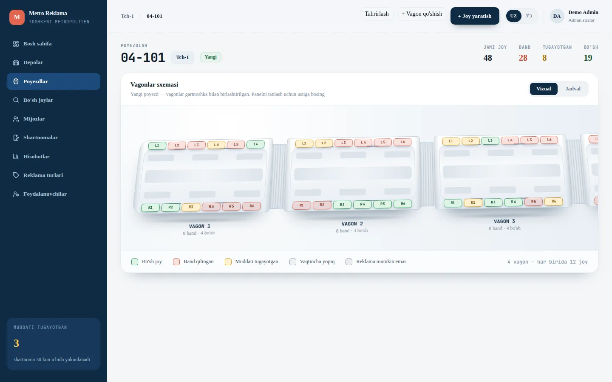
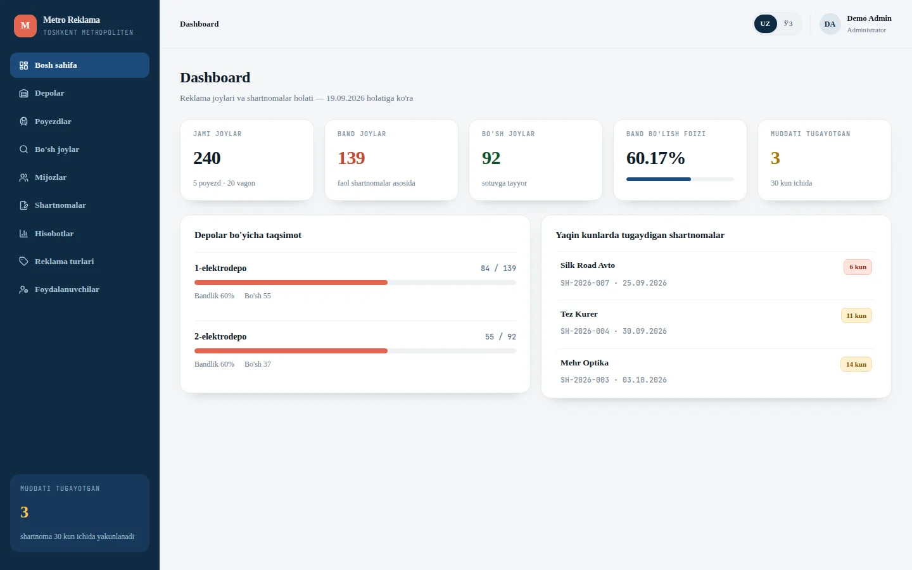
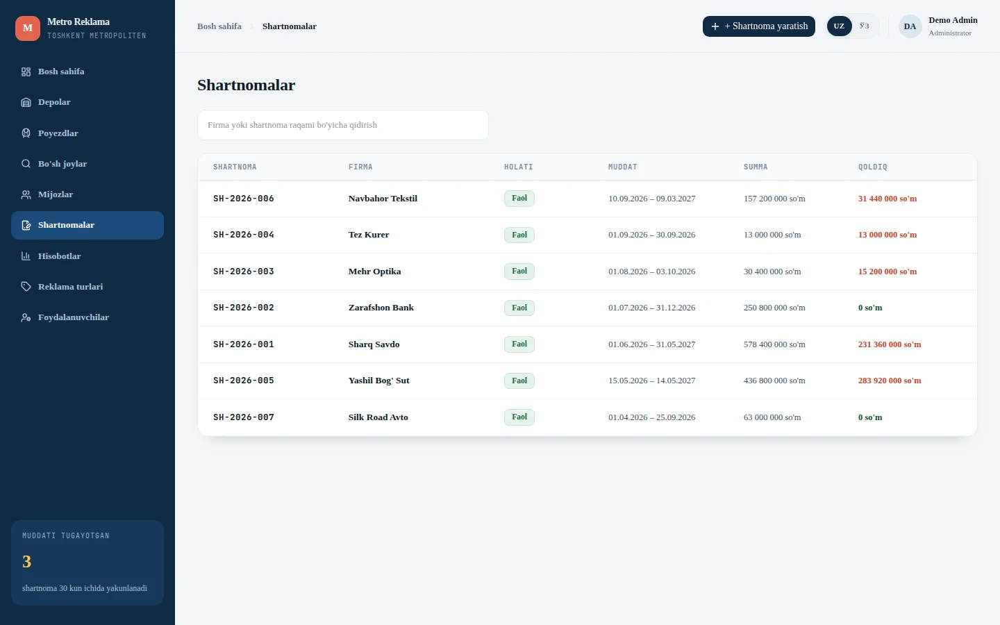
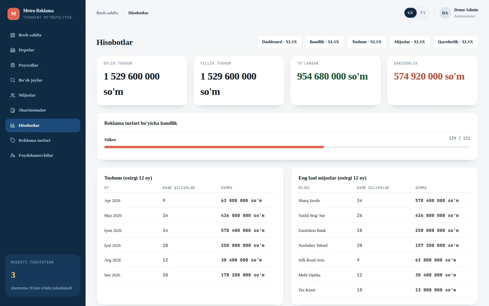
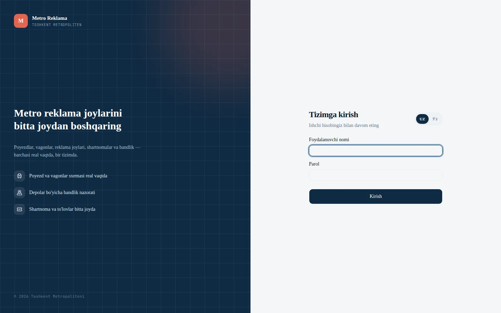
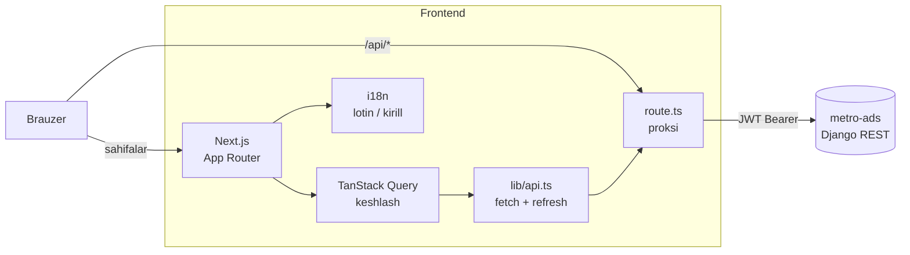

<div align="center">

# Metro Ads Web

**Metro reklama joylarini boshqarish paneli**
Poyezd sxemasi 3D koʻrinishda, band qilish, shartnomalar, toʻlovlar va hisobotlar — bitta oynada.




Backend: **[metro-ads](https://github.com/VALIJONY/metro-ads)** (Django REST Framework)

</div>

---

## Mundarija

- [Nima qiladi](#nima-qiladi)
- [Skrinshotlar](#skrinshotlar)
- [Imkoniyatlar](#imkoniyatlar)
- [Texnologiyalar](#texnologiyalar)
- [Arxitektura](#arxitektura)
- [Tez boshlash](#tez-boshlash)
- [Sozlamalar](#sozlamalar)
- [Loyiha tuzilishi](#loyiha-tuzilishi)
- [Dizaynga oid qarorlar](#dizaynga-oid-qarorlar)

---

## Nima qiladi

Metro reklama xodimi shu paneldan:

1. poyezd yaratadi — **4 vagon, 48 reklama joyi** avtomatik chiziladi;
2. vagon sxemasida qaysi joy **boʻsh, band, muddati tugayotgan, vaqtincha yopiq yoki reklama mumkin emas** ekanini bir qarashda koʻradi;
3. joyni bosib, kim band qilganini koʻradi yoki bronni bekor qiladi;
4. mijoz va shartnoma yaratadi, joylarni **ommaviy** band qiladi, toʻlovlarni yozadi;
5. bandlik, tushum va qarzdorlik hisobotlarini **Excel**ga yuklaydi.

Barcha biznes-qoidalar (ikki marta sotmaslik, muddat va maydon tekshiruvi) backendda; frontend serverdan kelgan xatoni aniq matn bilan koʻrsatadi.

## Skrinshotlar

<table>
  <tr>
    <td width="50%"><br><sub><b>Dashboard</b> — bandlik foizi, depolar boʻyicha taqsimot, muddati tugayotgan shartnomalar</sub></td>
    <td width="50%"><br><sub><b>Shartnomalar</b> — muddat, summa, qoldiq; qidiruv</sub></td>
  </tr>
  <tr>
    <td><br><sub><b>Hisobotlar</b> — tushum, qarzdorlik, bandlik, XLSX eksport</sub></td>
    <td><br><sub><b>Kirish</b> — lotin / kirill yozuvi almashtirgichi bilan</sub></td>
  </tr>
</table>

## Imkoniyatlar

| Sahifa | Nimalar bor |
| --- | --- |
| **Dashboard** | Jami / band / boʻsh joylar, bandlik foizi, depolar boʻyicha taqsimot, 30 kun ichida tugaydigan shartnomalar |
| **Depolar** | Depolar roʻyxati, har birining bandligi, yangi depo qoʻshish |
| **Poyezdlar** | Roʻyxat va qidiruv; poyezd sahifasida **3D vagon sxemasi** yoki **jadval** koʻrinishi, vagon qoʻshish, joy yaratish, tahrirlash |
| **Joy paneli** | Joyni bosganda: kod, maydon, narx, joriy bron (kim, qachon, qancha), **bronni bekor qilish**, joy tarixi |
| **Boʻsh joylar** | Sana oraligʻi, depo, poyezd, reklama turi va minimal maydon boʻyicha boʻsh joylarni qidirish |
| **Mijozlar** | Roʻyxat, mijoz sahifasi (shartnomalari va statistikasi) |
| **Shartnomalar** | Roʻyxat, shartnoma sahifasi: bronlar, toʻlovlar, qoldiq; ommaviy bron va toʻlov qoʻshish |
| **Hisobotlar** | Oylik / yillik tushum, toʻlangan va qarzdorlik, reklama turlari boʻyicha bandlik, faol mijozlar; 5 xil `.xlsx` yuklab olish |
| **Reklama turlari, Foydalanuvchilar** | Faqat **admin** roli uchun (menyuda faqat ularga koʻrinadi) |

Umumiy:

- **Ikki yozuv:** oʻzbek lotin ↔ kirill bitta tugma bilan; lugʻat ikki marta yozilmagan — kirill varianti [transliteratsiya algoritmi](src/lib/i18n/transliterate.ts) orqali avtomatik hosil qilinadi.
- **JWT sessiya:** access token eskirsa, klient refresh token bilan **bitta marta** yangilaydi (parallel soʻrovlar bitta `Promise` ni kutadi), keyin soʻrovni qayta yuboradi; refresh ham yaroqsiz boʻlsa — login sahifasiga.
- **Kesh va holat:** TanStack Query — soʻrovlar keshlanadi, oʻzgartirishdan keyin tegishli roʻyxatlar yangilanadi.
- **Xatolar:** backend `{error, message, details}` formatini `ApiRequestError` ga aylantiradi, `sonner` orqali bildirishnoma chiqadi.

## Texnologiyalar

| Nima | Nega |
| --- | --- |
| **Next.js 16** (App Router) + **React 19** | Marshrutlash, layoutlar, backendga proksi (`route.ts`) |
| **TypeScript** | Backend serializerlariga mos tiplar — [`src/lib/types.ts`](src/lib/types.ts) |
| **Tailwind CSS 4** + **shadcn/ui** (`@base-ui/react`) | Komponentlar va dizayn tokenlari |
| **TanStack Query 5** | Server holati, keshlash, qayta yuklash |
| **lucide-react**, **sonner** | Ikonkalar, bildirishnomalar |

## Arxitektura



`/api/*` soʻrovlari [`src/app/api/[...path]/route.ts`](src/app/api/%5B...path%5D/route.ts) orqali backendga uzatiladi — shunda brauzer uchun bitta origin (CORS muammosi va ngrok kabi tunnellarda ham ishlaydi). Django yoʻllari `/` bilan tugagani uchun `next.config.ts` da `trailingSlash: true`, proksi esa yoʻlni oʻzgartirmasdan uzatadi.

## Tez boshlash

Talab: **Node.js 20+** va ishga tushirilgan [`metro-ads`](https://github.com/VALIJONY/metro-ads) backendi.

```bash
# 1. Bogʻliqliklar
npm install

# 2. Sozlamalar
cp .env.example .env.local

# 3. Ishga tushirish
npm run dev
```

Ochish: <http://localhost:3000>

Backend alohida ishga tushirilgan boʻlishi kerak (`python manage.py runserver`, standart `localhost:8000`).

| Buyruq | Vazifasi |
| --- | --- |
| `npm run dev` | Dasturlash serveri |
| `npm run build` | Production yigʻish |
| `npm run start` | Production serverini ishga tushirish |
| `npm run lint` | ESLint |

## Sozlamalar

| Oʻzgaruvchi | Standart | Izoh |
| --- | --- | --- |
| `NEXT_PUBLIC_API_URL` | boʻsh | Boʻsh boʻlsa, soʻrovlar frontend serveri orqali proksi bilan ketadi (tavsiya). Backend boshqa manzilda boʻlsa, toʻliq URL yozing: `http://localhost:8000` |
| `BACKEND_INTERNAL_URL` | `http://localhost:8000` | Proksi qaysi backendga uzatishi (server tomonida) |

## Loyiha tuzilishi

```text
src/
├── app/
│   ├── login/                  # kirish sahifasi
│   ├── (app)/                  # autentifikatsiya talab qiladigan sahifalar (sidebar + header)
│   │   ├── page.tsx            #   dashboard
│   │   ├── depots/  trains/[id]/  free-spaces/
│   │   ├── clients/[id]/  contracts/[id]/
│   │   └── reports/  ad-types/  users/
│   └── api/[...path]/route.ts  # backendga proksi
├── components/
│   ├── TrainVisual.tsx         # 3D vagon sxemasi
│   ├── SpaceSidePanel.tsx      # joy paneli (bron, bekor qilish)
│   ├── Create*/Edit*/…Modal    # forma modallari
│   └── ui/                     # shadcn/ui elementlari
└── lib/
    ├── api.ts                  # fetch, JWT yangilash, xato formati
    ├── AuthContext.tsx  tokens.ts  types.ts
    ├── status.ts  format.ts    # holat ranglari, pul va sana formatlash
    └── i18n/                   # lugʻat, LanguageContext, transliteratsiya
design-reference/               # asl dizayn namunasi (Claude Design)
```

## Dizaynga oid qarorlar

Dizayn `design-reference/` dagi namuna asosida qoʻlda qayta yozilgan — ranglar, joylashuv va 3D vagon vizualizatsiyasi saqlangan, soxta maʼlumot oʻrniga haqiqiy API ulangan. Backend qoidalari sabab quyidagilar ataylab farq qiladi:

1. **Eshiklar sxemada yoʻq** — backend eshiklarni saqlamaydi; vagonda faqat 12 reklama joyi (6 chap + 6 oʻng) koʻrsatiladi.
2. **“Joy yaratish”** faqat reklama joyini yaratadi; haqiqiy band qilish alohida *mijoz → shartnoma → bron* zanjiri orqali.
3. **Joy paneli** haqiqiy bron maʼlumotini koʻrsatadi, “Bandlikni bekor qilish” `POST /bookings/{id}/cancel/` ni chaqiradi.
4. **Shartnomalar jadvali** shartnoma maydonlariga mos (holati, summa, qoldiq): bitta shartnomada bir nechta bron boʻlishi mumkin.
5. **Hisobotlar** haqiqiy `reports` API ga ulangan, Excel eksport ishlaydi.
